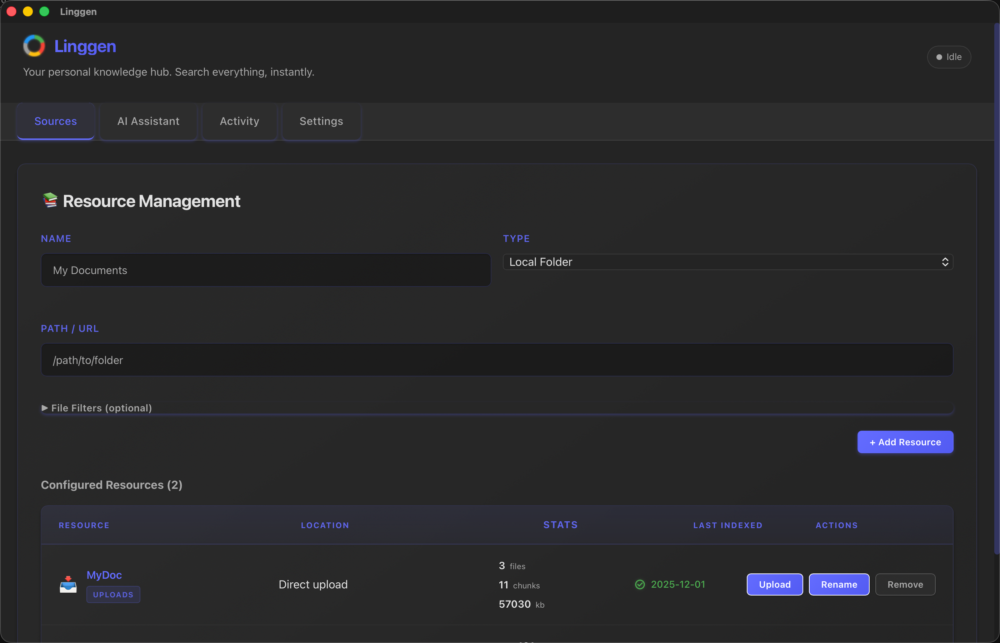

<p align="center">
  
  <br />
  <a href="https://linggen.dev">https://linggen.dev</a>
</p>

## Linggen Releases

Public download host for Linggen apps. macOS only for now.

All builds are codesigned and notarized.

---

## Apps

### Linggen

Local-first RAG + MCP memory layer for AI coding assistants. Index codebases, docs, and notes; semantic search and chat over them; expose an MCP server at `http://localhost:8787/mcp/sse` for Cursor, Zed, Windsurf, etc.

- Download: [latest release](https://github.com/linggen/linggen-releases/releases?q=linggen-v&expanded=true)
- Tag scheme: `linggen-v<version>`
- Docs: [linggen.dev](https://linggen.dev)



### Sys Doctor

On-device macOS diagnostic agent. Inspects disk, memory, processes, network, and logs; explains what it finds in plain English.

- Download: [latest release](https://github.com/linggen/linggen-releases/releases?q=sys-doctor-v&expanded=true)
- Tag scheme: `sys-doctor-v<version>`

---

## Install

1. Download the `.dmg` for the app you want.
2. Open it and drag the app into `Applications`.
3. On first launch, the shared Linggen engine downloads (~50 MB) and starts a local daemon at `http://127.0.0.1:9898`.

> All Linggen apps share one local engine and one `~/.linggen/` data directory.

---

## MCP Setup (Cursor)

Add to `~/.cursor/mcp.json`:

```json
{
  "mcpServers": {
    "linggen": {
      "url": "http://localhost:8787/mcp/sse"
    }
  }
}
```

Restart Cursor; `linggen` should appear as a connected MCP server.
